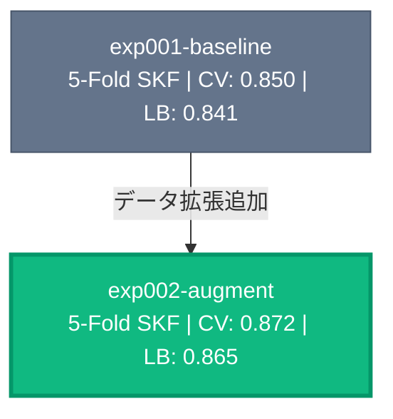

# CLAUDE.md

AI エージェントがこのリポジトリで作業する際のガイドライン。

## プロジェクト概要

Kaggle コンペティション用テンプレート。Hydra + Wandb で実験管理、FastAPI + htmx でダッシュボード。

## ディレクトリ構成

```
kaggle-template/
├── input/          # データ格納（gitignore）
├── output/         # 出力格納（gitignore）
├── sandbox/        # AI Agent 検証用（gitignore）
├── notebook/       # Jupyter Notebook（公開Code、検証用）
├── app/            # Web アプリ（FastAPI + htmx）
├── docs/
│   ├── official/   # Kaggle 公式情報
│   ├── discussion/ # Discussion 情報（YYYY-MM-DD_topic.md）
│   └── insights/   # 実験知見（YYYY-MM-DD_topic.md）
└── src/            # 実験ディレクトリ
    └── exp000-sample/
```

## 技術スタック

- **パッケージ管理**: uv
- **実験管理**: Hydra, Wandb
- **モデル学習**: PyTorch Lightning（最新版）、wandb logger、rich progress
  - Trainer 内蔵ライブラリ（transformers 等）はその Trainer 利用も検討
  - MPS / CUDA / CPU を想定（`pin_memory` は GPU 時のみ有効化、`accelerator="auto"` を使用）
- **Web アプリ**: FastAPI, htmx, Jinja2

## TDD 適用除外

このプロジェクトでは TDD は適用しない。`run_mode=debug` でパイプライン全体の動作確認を行うことで代替する。

## 実験ディレクトリの規則

### 命名・構成

`exp{番号}-{subtitle}` 形式。各実験は独立し、他の実験に依存しない。共通コードが必要な場合はコピーする。

```
src/exp001-xxx/
├── README.md       # 目的・仮説・結果・考察
├── train.py        # 学習スクリプト
├── inference.py    # 推論スクリプト
├── model.py        # モデル定義
├── data.py         # データ処理
└── config/
    └── config.yaml
```

### 推論スクリプト

各実験ディレクトリに `inference.py` を作成し、`sample_submission.csv` と同じ形式の CSV を出力する。

### 実行モード

`config.yaml` の `run_mode` で実行モードを切り替える。デフォルトは `fold0`。

| モード | 動作 | 用途 |
|--------|------|------|
| `debug` | データ・エポック制限、fold0 のみ、wandb disabled | パイプラインの動作確認 |
| `fold0`（デフォルト） | fold0 のみ、通常のデータ量・エポック数 | 高速に1セット学習して性能確認 |
| `full` | 全 fold 実行 | 完全な CV スコア算出・OOF 予測生成 |

まず `debug` でパイプラインが通ることを確認 → `fold0` で性能確認 → `full` で本番実行の流れ。

### wandb ログの統一

評価指標の wandb log は実験を跨いで比較するため、同じキー名を使い続ける。表記揺れ（`acc` vs `accuracy`、`valid` vs `val`）を避ける。メトリクス名はプロジェクト初回の実験で決定し、以降変更しない。

### チェックポイントと出力

```
output/{exp_name}/
├── fold0/
│   ├── {exp_name}-val_score={score}.ckpt
│   ├── train.csv       # この fold の学習データ index/ID
│   └── val.csv         # この fold の検証データ index/ID
├── fold1/
│   └── ...
└── oof_predictions.csv  # full モードで生成
```

- **チェックポイント**: `ModelCheckpoint` で `output/{exp_name}/fold{i}/` に保存。ファイル名に実験名と val スコアを含む
- **train/val split**: 各 fold の train.csv, val.csv を保存し OOF の再現性を担保
- **再実行時は上書き**: 同一設定の再実行は問題なし。パラメータを変えて比較したい場合は新しい実験ディレクトリを作成する

### 再現性

シード固定（random, numpy, torch）、シード値は `config.yaml` に記録、環境は `uv.lock` で管理。

### 実験後の更新（必須）

1. **各実験の README.md**: 目的・仮説（開始時）、結果・考察（完了時）
2. **ルート README.md**: Experiments テーブルと Experiment Tree を更新
3. **docs/insights/**: `YYYY-MM-DD_exp{番号}-{subtitle}.md` で知見を記録

**Experiments テーブルのフォーマット:**

| Exp | Name | Split | Key Change | CV | LB |
|-----|------|-------|------------|----|----|

- `Split`: 分割方法（例: `5-Fold SKF`, `GroupKFold(user)`）
- `Key Change`: 前実験からの主な変更点・実験の焦点

**Experiment Tree（Mermaid）のフォーマット:**

- ノード: `"exp名<br/>Split | CV: x.xxx | LB: x.xxx"`
- エッジラベル: 前実験からの主な変更点（= Key Change）
- スタイル: `best`(緑)=最高LB, `good`(青)=完了, `base`(灰)=ベースライン, `wip`(黄/破線)=進行中

例:



**exp000 はサンプル実験のため、exp001 以降が作成された後は Experiments テーブルおよび Experiment Tree に載せない。**

## 探索の独立性（AI エージェントへの注意）

LLM は過去の実験結果に引きずられ、探索空間を狭めてしまう傾向がある。

**引き継いでよいもの（コードレベルの知見のみ）:**
- データ前処理・特徴量生成の実装上の工夫
- バグ修正・速度改善の技術的発見
- `docs/insights/` に記録された実装知見

**引き継いではいけないもの:**
- 「このアプローチはうまくいかない」という結論
- 特定の手法やモデルへの偏り・先入観
- 探索範囲の絞り込み

**新しい実験では:** 問題の本質・データの特性・ドメイン知識から仮説をゼロベースで立てる。

## 疑問点の確認（AI エージェントへの注意）

不明点や曖昧な点がある場合は、推測で進めずにユーザに質問すること。一度の質問で解消しない場合は、理解できるまで繰り返し質問する。特に以下の場面では必ず確認する:

- 実験の方針・仮説の妥当性に自信がないとき
- 複数のアプローチが考えられ、どれを選ぶべきか判断できないとき
- コンペ固有のドメイン知識が必要なとき

## sandbox

AI Agent が検証用スクリプトを実行するディレクトリ。gitignore される。

## Git 規則

- **ブランチ**: `main`（デフォルト）、`exp/{番号}-{subtitle}`、`feature/{名前}`、`fix/{内容}`
- **コミット**: gitmoji + 日本語。1コミット = 1つの論理的な変更。例: `🧪 exp001-baseline を追加`
- **push**: 作業の区切りごと、実験完了時に push

## コマンド

```bash
uv sync                        # 依存関係インストール
just app                       # Web アプリ起動
uv run python -m src.exp001-baseline.train                  # fold0 のみで学習（デフォルト）
uv run python -m src.exp001-baseline.train run_mode=debug   # デバッグモード
uv run python -m src.exp001-baseline.train run_mode=full    # 全 fold で学習
```
