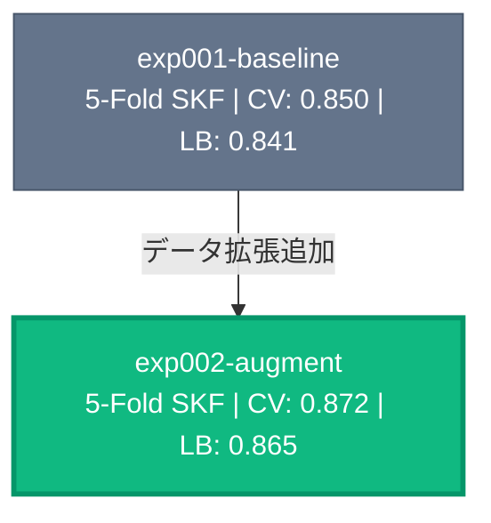

# CLAUDE.md

This file provides guidance to Claude Code (claude.ai/code) when working with code in this repository.

AI エージェントがこのリポジトリで作業する際のガイドライン。

## プロジェクト概要

Kaggle コンペティション用テンプレート。Hydra + Wandb で実験管理、FastAPI + htmx でダッシュボード。

## ディレクトリ構成

```
kaggle-template/
├── input/          # データ格納（gitignore）
├── sandbox/        # AI Agent 検証用（gitignore）
├── app/            # Web アプリ（FastAPI + htmx）
├── docs/
│   ├── official/   # Kaggle 公式情報
│   ├── discussion/ # Discussion 情報（YYYY-MM-DD_topic.md）
│   └── insights/   # 実験知見（YYYY-MM-DD_topic.md）
└── src/            # 実験ディレクトリ
    └── exp000-sample/
        ├── config/                   # ベース config + 小実験 config
        ├── inference_notebook.ipynb  # Kaggle 推論 notebook
        └── output/                   # 学習出力（gitignore）
```

## 技術スタック

- **パッケージ管理**: uv
- **実験管理**: Hydra, Wandb
- **モデル学習**: PyTorch Lightning（最新版）、wandb logger、rich progress
  - Trainer 内蔵ライブラリ（transformers 等）はその Trainer 利用も検討
  - MPS / CUDA / CPU を想定（`pin_memory` は GPU 時のみ有効化、`accelerator="auto"` を使用）
- **Web アプリ**: FastAPI, htmx, Jinja2

## Web アプリ（ダッシュボード）の実装方針

- **ナビゲーション構造**: サイドバーのトップレベルは Experiments / Data / Knowledge の3つ。新ページはまず既存セクションのサブページとして追加を検討し、どこにも属さない場合のみトップレベルに追加する
- **ページレイアウト**: サイドバー内にさらにサイドバーを入れる「2重サイドバー」は避ける。Data ページのファイルツリーのような専用 UI は例外
- **スタイルの詳細**: `app/README.md` を参照

## TDD 適用除外

このプロジェクトでは TDD は適用しない。`run_mode=debug` でパイプライン全体の動作確認を行うことで代替する。

## 実験ディレクトリの規則

### 命名・構成

`exp{番号}-{subtitle}` 形式（大実験）。各実験は独立し、他の実験に依存しない。共通コードが必要な場合はコピーする。

```
src/exp001-xxx/
├── README.md       # 目的・仮説・結果・Runs テーブル・考察
├── train.py        # 学習スクリプト
├── inference.py    # 推論スクリプト
├── inference_notebook.ipynb  # Kaggle 推論 notebook（/kaggle:create-inference-notebook で生成）
├── model.py        # モデル定義
├── data.py         # データ処理
├── config/
│   ├── config.yaml           # ベース設定（run_name: run000-base）
│   ├── run001-yyy.yaml       # 小実験1（差分のみ、defaults: [config] で継承）
│   └── run002-zzz.yaml       # 小実験2
├── logs/                     # 学習メトリクスログ（gitignore、自動生成）
│   └── run000-base/
│       ├── fold0_metrics.csv # epoch ごとの train/loss, val/loss 等
│       └── run_summary.json  # CV スコア、各 fold のベスト、config snapshot
└── output/                   # gitignore
    ├── run000-base/          # ベース config の出力
    │   ├── fold0/
    │   │   ├── {exp_name}-val_{評価指標名}={score}.ckpt
    │   │   ├── train.csv
    │   │   └── val.csv
    │   └── oof_predictions.csv
    └── run001-yyy/
        └── ...
```

### 小実験（Run）の規則

大実験の範囲内でモデル名・ハイパーパラメータ・前処理の細かな変更を行う場合は、小実験（Run）として `config/run{NNN}-{subtitle}.yaml` を追加する。

- **大実験の基準**: アプローチ・アーキテクチャ・データパイプライン・バリデーション戦略が根本的に異なる場合に新規作成
- **小実験の基準**: 既存大実験のコードを共有し、config の差分のみで表現できる変更

**小実験 config の形式**（差分のみ記述、ベース config を Hydra defaults で継承）:

```yaml
# config/run001-bert.yaml
defaults:
  - config    # ベース config.yaml を継承

run_name: run001-bert

model:
  name: bert-base-uncased

training:
  lr: 2e-5
```

**実行コマンド**:

```bash
# ベース config で実行
uv run python -m src.exp001-xxx.train

# 小実験を指定して実行
uv run python -m src.exp001-xxx.train --config-name=run001-bert

# run_mode も指定可能
uv run python -m src.exp001-xxx.train --config-name=run001-bert run_mode=debug
```

### 推論スクリプト

各実験ディレクトリに `inference.py` を作成し、`sample_submission.csv` と同じ形式の CSV を出力する。

### 実行モード

`config.yaml` の `run_mode` で実行モードを切り替える。デフォルトは `fold0`。

| モード | 動作 | 用途 |
|--------|------|------|
| `debug` | 少数データ・少数バッチ・1エポック・1fold・wandb disabled | パイプラインの動作確認 |
| `fold0`（デフォルト） | fold0 のみ、通常のデータ量・エポック数 | 高速に1セット学習して性能確認 |
| `full` | 全 fold 実行 | 完全な CV スコア算出・OOF 予測生成 |

まず `debug` でパイプラインが通ることを確認 → `fold0` で性能確認 → `full` で本番実行の流れ。

### wandb の k-fold ログ方針

**基本原則**: fold ごとに独立した wandb run を作成し、`group` で束ねる。

**run 構造**（例: `run_mode=full`, 5-fold）:

```
Group: {exp_name}/{run_name}_{run_mode}

├── fold_0  (job_type: "train")  ← 各 fold の学習曲線を記録
├── fold_1  (job_type: "train")
├── ...
├── fold_4  (job_type: "train")
└── summary (job_type: "summary") ← CV スコアのみ記録（学習曲線なし）
```

- `fold0` モードでは `fold_0` の run のみ作成。summary run は作成しない
- `debug` モードでは wandb 自体が disabled

**wandb.init パラメータ**:

```python
# fold run（各 fold の学習用）
wandb.init(
    project=cfg.wandb.project,
    entity=cfg.wandb.entity,
    group=f"{cfg.exp_name}/{cfg.run_name}_{cfg.run_mode}",
    name=f"fold_{fold_idx}",
    job_type="train",
    config=OmegaConf.to_container(cfg, resolve=True),
    mode=run_cfg["wandb_mode"],
    reinit=True,  # 同一プロセスで複数回 init するために必須
)

# summary run（full モード && wandb 有効 && fold≥2 の場合のみ）
wandb.init(
    ...,
    name="summary",
    job_type="summary",
)
wandb.summary["cv/{評価指標名}"] = cv_mean
wandb.summary["cv/{評価指標名}_std"] = cv_std
wandb.finish()
```

- `WandbLogger(experiment=wandb.run)` を Trainer に渡し、PL の `self.log()` を現在の fold run に記録

**メトリクスキー名規則**: `{split}/{metric}` 形式。全実験で統一し、表記揺れ（`acc` vs `accuracy`、`valid` vs `val`）を避ける。`{評価指標名}` は `/kaggle:init` 実行時にユーザーに確認し、実際のメトリクス名（例: `auc`, `f1`, `accuracy`）に置換する。以降変更しない。

| キー名 | 意味 | 記録場所 |
|--------|------|----------|
| `train/loss` | 学習ロス（epoch 平均） | fold run |
| `train/{評価指標名}` | 学習メトリクス（← `/kaggle:init` で置換） | fold run |
| `val/loss` | 検証ロス（epoch 平均） | fold run |
| `val/{評価指標名}` | 検証メトリクス（← `/kaggle:init` で置換） | fold run |
| `cv/{評価指標名}` | 全 fold の best `val/{評価指標名}` の平均 | summary run の `wandb.summary` |
| `cv/{評価指標名}_std` | 同標準偏差 | summary run の `wandb.summary` |
| `fold{i}/best_val_{評価指標名}` | 各 fold の best `val/{評価指標名}` | summary run の `wandb.summary` |

**ライフサイクル**:

```python
for fold_idx in folds:
    wandb.init(...)          # fold run 開始
    trainer.fit(...)         # PL が self.log() → WandbLogger 経由で記録
    wandb.finish()           # fold run 終了

# full モードのみ
wandb.init(...)              # summary run 開始
wandb.summary["cv/{評価指標名}"] = ...
wandb.finish()               # summary run 終了
```

**run_mode ごとの挙動**:

| run_mode | wandb_mode | fold 数 | 作成される run | summary run |
|----------|------------|---------|---------------|-------------|
| `debug` | disabled | 1 | なし | なし |
| `fold0` | online | 1 | `fold_0` のみ | なし |
| `full` | online | N | `fold_0` 〜 `fold_{N-1}` | あり |

### チェックポイントと出力

出力は各実験の `output/{run_name}/` 配下に保存される。

```
src/{exp_name}/output/{run_name}/
├── fold0/
│   ├── {exp_name}-val_score={score}.ckpt
│   ├── train.csv       # この fold の学習データ index/ID
│   └── val.csv         # この fold の検証データ index/ID
├── fold1/
│   └── ...
└── oof_predictions.csv  # full モードで生成
```

- **チェックポイント**: `ModelCheckpoint` で `src/{exp_name}/output/{run_name}/fold{i}/` に保存。ファイル名に実験名と val スコアを含む
- **train/val split**: 各 fold の train.csv, val.csv を保存し OOF の再現性を担保
- **再実行時は上書き**: 同一設定の再実行は問題なし。パラメータを変えて比較したい場合は小実験（Run）を追加する

### ローカルメトリクスログ

`MetricsLogger`（`src/utils/metrics_logger.py`）を使い、wandb と並行してローカルにメトリクスを保存する。wandb にアクセスせずとも学習曲線や CV スコアを確認できる。

```python
from src.utils.metrics_logger import MetricsLogger

# wandb.init() の後
metrics_logger = MetricsLogger(cfg)

# 各 epoch で wandb.log() と併用
metrics_logger.log_epoch(fold_idx, {"epoch": epoch, "train/loss": train_loss, "val/loss": val_loss})

# 学習完了時（wandb.finish() の前）
metrics_logger.finish()
```

出力先は `src/{exp_name}/logs/{run_name}/`（gitignore 対象）。ダッシュボードの Logs タブで学習曲線を閲覧可能。

### 再現性

シード固定（random, numpy, torch）、シード値は `config.yaml` に記録、環境は `uv.lock` で管理。

### 実験後の更新（必須）

1. **各実験の README.md**: 目的・仮説（開始時）、結果・Runs テーブル・考察（完了時）
2. **EXP_SUMMARY.md**: Experiments テーブルと Experiment Tree を更新（大実験の best run のスコアを記載）
3. **docs/insights/**: `YYYY-MM-DD_exp{番号}-{subtitle}.md` で知見を記録

**Experiments テーブルのフォーマット:**

| Exp | Name | Split | Key Change | CV | LB |
|-----|------|-------|------------|----|----|

- `Split`: 分割方法（例: `5-Fold SKF`, `GroupKFold(user)`）
- `Key Change`: 前実験からの主な変更点・実験の焦点

**Experiment Tree（Mermaid）のフォーマット:**

実験の進捗・成果が一目で把握できるよう、ステータスごとに色分けしたカラフルなツリーにする。色によって「どの実験が最高スコアか」「どれが進行中か」を視覚的に即座に判別できることが重要。

- ノード: `"exp名<br/>Split | CV: x.xxx | LB: x.xxx"`
- エッジラベル: 前実験からの主な変更点（= Key Change）
- スタイル（必ず `classDef` で色を定義し、全ノードにクラスを割り当てる）:
  - `best`（緑 `#10b981`）= 最高 LB、太枠で強調
  - `good`（青 `#3b82f6`）= 完了した実験
  - `base`（灰 `#64748b`）= ベースライン
  - `wip`（黄 `#f59e0b`、破線）= 進行中の実験

例:



**exp000 はサンプル実験のため、exp001 以降が作成された後は Experiments テーブルおよび Experiment Tree に載せない。**

## 探索の独立性（AI エージェントへの注意）

LLM は過去の実験結果に引きずられ、探索空間を狭めてしまう傾向がある。

**引き継いでよいもの（コードレベルの知見のみ）:**
- データ前処理・特徴量生成の実装上の工夫
- バグ修正・速度改善の技術的発見
- `docs/insights/` に記録された実装知見

**引き継いではいけないもの:**
- 「このアプローチはうまくいかない」という結論
- 特定の手法やモデルへの偏り・先入観
- 探索範囲の絞り込み

**新しい実験では:** 問題の本質・データの特性・ドメイン知識から仮説をゼロベースで立てる。

## 疑問点の確認（AI エージェントへの注意）

不明点や曖昧な点がある場合は、推測で進めずにユーザに質問すること。一度の質問で解消しない場合は、理解できるまで繰り返し質問する。特に以下の場面では必ず確認する:

- 実験の方針・仮説の妥当性に自信がないとき
- 複数のアプローチが考えられ、どれを選ぶべきか判断できないとき
- コンペ固有のドメイン知識が必要なとき

## sandbox

AI Agent が検証用スクリプトを実行するディレクトリ。gitignore される。

### sandbox → app/static パイプライン

sandbox/ で生成した EDA 画像や分析結果をダッシュボードで表示するためのパターン。

1. sandbox/ 内のスクリプトで画像・データを生成
2. 成果物を `app/static/analysis/` にコピー（例: `app/static/analysis/eda/`）
3. ダッシュボードのテンプレートから `/static/analysis/...` パスで参照

```html
<!-- テンプレートでの参照例 -->

```

**注意**: `app/static/` は単一の StaticFiles マウントで提供される。別途 StaticFiles マウントを追加しないこと。

## Git 規則

- **ブランチ**: `main`（デフォルト）、`exp/{番号}-{subtitle}`、`feature/{名前}`、`fix/{内容}`
- **コミット**: gitmoji + 日本語。1コミット = 1つの論理的な変更。例: `🧪 exp001-baseline を追加`
- **push**: 作業の区切りごと、実験完了時に push

## コマンド

```bash
uv sync                        # 依存関係インストール
just app                       # Web アプリ起動（http://localhost:8000）

# Lint / Format
uv run ruff check src/ app/    # Lint
uv run ruff format src/ app/   # Format

# 大実験のベース config で実行
uv run python -m src.exp001-baseline.train                  # fold0 のみで学習（デフォルト）
uv run python -m src.exp001-baseline.train run_mode=debug   # デバッグモード
uv run python -m src.exp001-baseline.train run_mode=full    # 全 fold で学習

# 小実験を指定して実行
uv run python -m src.exp001-baseline.train --config-name=run001-bert
uv run python -m src.exp001-baseline.train --config-name=run001-bert run_mode=debug
```

## Skills（Claude Code スキル）

| スキル | 説明 |
|--------|------|
| `/kaggle:init` | テンプレート初期化（コンペ名・データ・docs セットアップ） |
| `/kaggle:new-experiment` | 新しい実験を対話的に設計・作成 |
| `/kaggle:record-result` | 実験結果を記録（README・EXP_SUMMARY・insights 更新） |
| `/kaggle:commit` | 変更を論理単位でコミット＆プッシュ |
| `/kaggle:check-commands` | 実行コマンドの確認 |
| `/kaggle:add-app-page` | ダッシュボードに新ページ追加 |
| `/kaggle:upload-checkpoints` | チェックポイントを Kaggle Datasets にアップロード |
| `/kaggle:create-inference-notebook` | 推論ノートブックを作成 |
