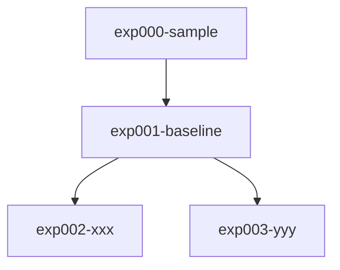

# Competition Name

> コンペティションの概要をここに記載

## Directory Structure

```
kaggle-template/
├── input/          # データ格納（gitignore）
├── output/         # 出力格納（gitignore）
├── sandbox/        # AI Agent 検証用（gitignore）
├── notebook/       # Jupyter Notebook（公開Code、検証用）
├── app/            # Web アプリ（FastAPI + htmx）
├── docs/           # ドキュメント
│   ├── official/   # Kaggle 公式情報
│   ├── discussion/ # Kaggle Discussion 情報
│   └── insights/   # 実験から得た知見
└── src/            # 実験ディレクトリ
    └── exp001-xxx/ # 各実験（独立した構成）
```

## Experiments

| Exp | Name | CV | LB | Description |
|-----|------|----|----|-------------|
| exp000 | sample | - | - | サンプル実験（テンプレート） |

## Validation Strategy

> 検証データの作り方をここに記載
>
> - どのようにデータを分割するか
> - 学習データとの分布の違い
> - リークの有無の確認方法

## Experiment Tree



## Setup

```bash
# Install dependencies
uv sync

# Run web app
uv run uvicorn app.main:app --reload
```
