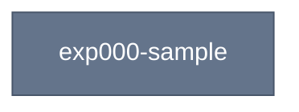

# Competition Name

> コンペティションの概要をここに記載

## Directory Structure

```
kaggle-template/
├── input/          # データ格納（gitignore）
├── sandbox/        # AI Agent 検証用（gitignore）
├── notebook/       # Jupyter Notebook（公開Code、検証用）
├── app/            # Web アプリ（FastAPI + htmx）
├── docs/           # ドキュメント
│   ├── official/   # Kaggle 公式情報
│   ├── discussion/ # Kaggle Discussion 情報
│   └── insights/   # 実験から得た知見
└── src/            # 実験ディレクトリ
    └── exp000-sample/
        ├── config/     # ベース config + 小実験 config
        └── output/     # 学習出力（gitignore）
```

## Experiments

| Exp | Name | Split | Key Change | CV | LB |
|-----|------|-------|------------|----|----|
| exp000 | sample | - | テンプレート | - | - |

## Validation Strategy

> 検証データの作り方をここに記載
>
> - どのようにデータを分割するか
> - 学習データとの分布の違い
> - リークの有無の確認方法

## Experiment Tree


```mermaid
graph TD
    A["exp000-sample"]

    classDef best fill:#10b981,stroke:#059669,color:#fff,stroke-width:3px
    classDef good fill:#3b82f6,stroke:#2563eb,color:#fff
    classDef base fill:#64748b,stroke:#475569,color:#fff
    classDef wip fill:#f59e0b,stroke:#d97706,color:#fff,stroke-dasharray:5 5

    class A base
```

<!-- Experiment Tree ルール
- ステータスごとに色分けしたカラフルなツリーにし、進捗・成果を視覚的に即座に判別できるようにする
- ノード: "exp名<br/>Split | CV: x.xxx | LB: x.xxx"
- エッジラベル: 前実験からの主な変更点（= Key Change）
- classDef で色を定義し、全ノードにクラスを割り当てる:
  - best(緑 #10b981)=最高LB（太枠で強調）
  - good(青 #3b82f6)=完了
  - base(灰 #64748b)=ベースライン
  - wip(黄 #f59e0b、破線)=進行中
-->

## Setup

```bash
# 依存関係インストール
uv sync

# Web アプリ起動
just app

# 実験実行（詳細は CLAUDE.md 参照）
uv run python -m src.exp001-baseline.train                              # ベース config で fold0
uv run python -m src.exp001-baseline.train run_mode=debug               # デバッグモード
uv run python -m src.exp001-baseline.train --config-name=run001-bert    # 小実験を指定
uv run python -m src.exp001-baseline.train run_mode=full                # 全 fold
```
