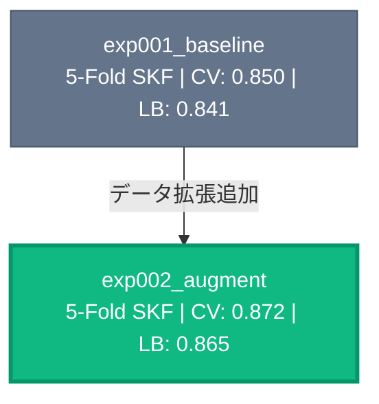

# EXP_SUMMARY.md 更新フォーマット

実験完了後に `EXP_SUMMARY.md` を更新する際のフォーマット仕様。

## Experiments テーブル

| Exp | Name | Split | Key Change | CV | LB |
|-----|------|-------|------------|----|----|

- `Split`: 分割方法（例: `5-Fold SKF`, `GroupKFold(user)`）
- `Key Change`: 前実験からの主な変更点・実験の焦点
- 各行のスコアは大実験の best run のもの。best の判定は `docs/competition-profile.yaml` の `selection.policy`（デフォルト `cv`）と `metric.mode` に従う

## 実験 README の Runs テーブル

各実験の `README.md` の Runs テーブルは**実行順（時系列）に追記する**。行き詰まり検出（`/kaggle:record-result`）が「直近 3 run」をテーブルの並び順から判定するため、並び替えは行わない。

## Experiment Tree（Mermaid）

実験の進捗・成果が一目で把握できるよう、ステータスごとに色分けしたカラフルなツリーにする。色によって「どの実験が最高スコアか」「どれが進行中か」を視覚的に即座に判別できることが重要。

- ノード: `"exp名 Split | CV: x.xxx | LB: x.xxx"`
- エッジラベル: 前実験からの主な変更点（= Key Change）
- スタイル（必ず `classDef` で色を定義し、全ノードにクラスを割り当てる）:
  - `best`（緑 `#10b981`）= 全実験中の best。判定は profile の `selection.policy`（デフォルト `cv` = 最良 CV）と `metric.mode` に従う。太枠で強調
  - `good`（青 `#3b82f6`）= 完了した実験
  - `base`（灰 `#64748b`）= ベースライン
  - `wip`（黄 `#f59e0b`、破線）= 進行中の実験
  - `dead`（赤 `#ef4444`）= 行き止まりの実験

### 例

**exp000 はサンプル実験のため、exp001 以降が作成された後は Experiments テーブルおよび Experiment Tree に載せない。**
