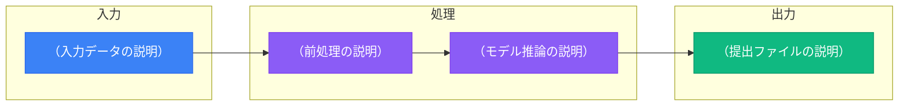
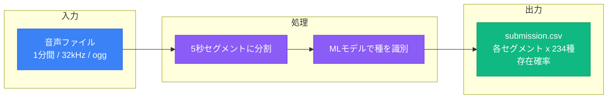

# Overview

## コンペティション概要

- **コンペ名**:
- **URL**:
- **開催期間**: YYYY-MM-DD ~ YYYY-MM-DD
- **ホスト**:

## タスク定義

<!-- コンペが求めるタスクを具体的に記述する -->
<!-- 例: 「音声データからどの種が鳴いているかを予測する多ラベル分類タスク」 -->

- **タスクの種類**: （例: 多ラベル分類、回帰、物体検出 など）
- **入力**: （例: 1分間の音声ファイル → 5秒ごとのセグメント）
- **出力**: （例: 各セグメント x 各種の存在確率）

### パイプライン概要図

<!-- コンペのタスクを「入力 → 処理 → 出力」で図示する -->
<!-- ノードの中身をコンペに合わせて書き換える -->

<!-- 例: BirdCLEF2026 の場合 -->
<!--

-->

## 背景・ドメイン知識

<!-- コンペの背景にある課題やドメイン固有の知識を記述 -->
<!-- 解法の方針を立てるために重要な情報をここにまとめる -->

-

## 評価指標（Evaluation）

- **指標名**: （例: macro-averaged ROC-AUC）
- **計算方法**:

<!-- 指標が一般的でない場合、計算式や挙動の補足を入れる -->
<!-- 例: 「真陽性がないクラスはスキップされる」 -->

### 最適化の考慮点

<!-- この指標を最適化する上で注意すべき点 -->
<!-- 例: 閾値の選び方、クラス不均衡への対処 など -->

-

## 提出形式（Submission Format）

- **ファイル名**: （例: submission.csv）
- **形式**:

<!-- row_id の構成や、カラムの意味を具体的に記述 -->

## コード要件（Code Requirements）

<!-- Code Competition かどうか、ランタイム制限、GPU/Internet の可否 -->

- **Code Competition**: Yes / No
- **CPU 制限時間**: （例: 90分）
- **GPU**: 有効 / 無効
- **インターネット**: 有効 / 無効
- **外部データ**: 利用可 / 利用不可（条件: ）

## タイムライン

| イベント | 日付 |
|----------|------|
| 開始 | |
| エントリー締切 | |
| チームマージ締切 | |
| 最終提出締切 | |
